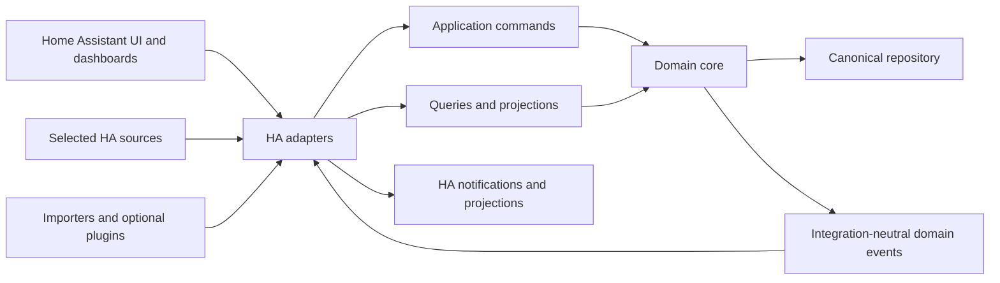
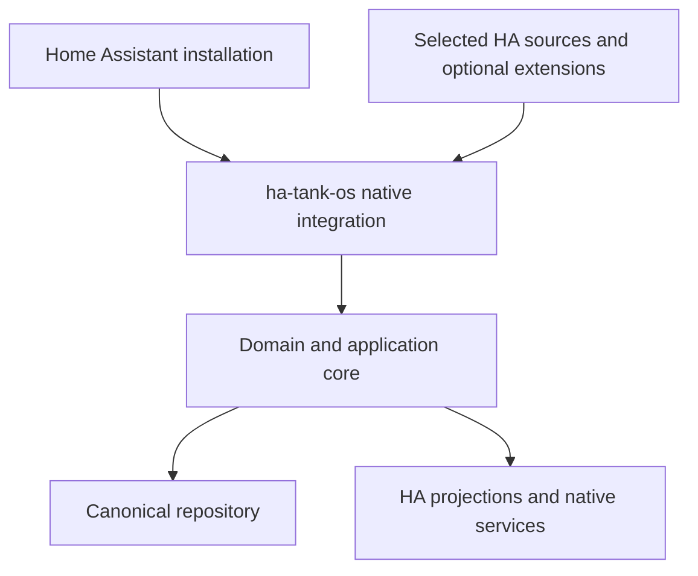
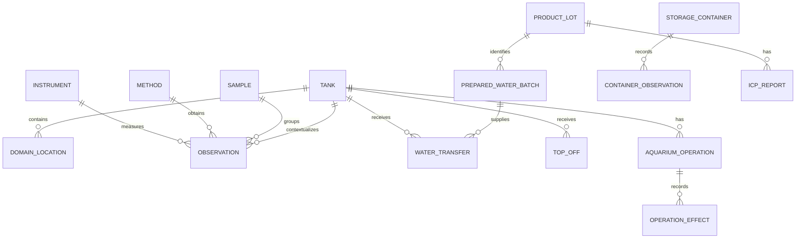

# Architecture Spine — ha-tank-os

## Design Paradigm

ha-tank-os is a modular hexagonal monolith delivered as a native Home Assistant integration.

- The **domain core** owns aquarium meaning, invariants, stable identities, provenance, and canonical records.
- **Application commands and queries** are the only supported paths into the core.
- **Adapters** translate manual input, Home Assistant entities/events, imports, plugins, notifications, and presentation requests.
- **Persistence** is behind a domain repository boundary and is owned by ha-tank-os.
- **Projections** expose selected current values and integration surfaces to Home Assistant; they are not the historical archive.
- The single deployment keeps V1 operationally simple while the internal boundaries preserve a future extraction path if that later earns its cost.

Dependency direction:



## Invariants & Rules

### AD-1 — Native Home Assistant product boundary [ADOPTED]

- **Binds:** all capabilities
- **Prevents:** a premature external service and domain rules scattered across HA entities or YAML
- **Rule:** The product is delivered as a native Home Assistant integration with a modular internal core.

### AD-2 — Canonical domain persistence [ADOPTED]

- **Binds:** CAP-01–CAP-17
- **Prevents:** Recorder retention, aggregation, or purging becoming an accidental source of truth
- **Rule:** ha-tank-os owns canonical domain records; Home Assistant Recorder/History is reused only where it preserves the required semantics.

### AD-3 — One write core [ADOPTED]

- **Binds:** all writes and CAP-02–CAP-16
- **Prevents:** manual capture, HA listeners, importers, and plugins implementing incompatible validation or provenance rules
- **Rule:** Every write enters through the application/domain core; adapters never write directly to persistence.

### AD-4 — Native UI before custom UI [ADOPTED]

- **Binds:** CAP-03, CAP-04, CAP-11, CAP-12, CAP-13, CAP-17–CAP-21
- **Prevents:** duplicating Home Assistant configuration, dashboards, services, notifications, or history without a material gap
- **Rule:** Use suitable Home Assistant Core and ecosystem capabilities first; custom UI is justified only for a documented traceability, semantic, or usability gap.

### AD-5 — Selected-source ingestion [ADOPTED]

- **Binds:** CAP-03, CAP-04, CAP-08
- **Prevents:** copying every HA update into canonical storage and obscuring useful history with sensor noise
- **Rule:** Maintain explicit source associations and per-source ingestion policies; suggestions remain inactive until accepted.

### AD-6 — Transactional repository and recoverable persistence [ADOPTED]

- **Binds:** CAP-01–CAP-16
- **Prevents:** partial records, unversioned migrations, and recovery that silently loses or changes domain meaning
- **Rule:** Canonical writes are transactional, persistence migrations are versioned, and export/import preserves semantic identity; the concrete storage API remains a validated technical choice.

### AD-7 — Home Assistant identity authority [ADOPTED]

- **Binds:** CAP-15–CAP-17 and all user actions
- **Prevents:** conflicting users, roles, credentials, and authorization semantics
- **Rule:** Use Home Assistant's identity and permission authority in V1; do not create parallel ha-tank-os credentials or roles.

### AD-8 — No implicit physical action [ADOPTED]

- **Binds:** CAP-03, CAP-12, CAP-13 and all read/write flows
- **Prevents:** recording, import, correction, notification, or projection from actuating equipment
- **Rule:** V1 has no physical-control path; future control requires a separate approved change with explicit permissions, safeguards, and validation.

### AD-9 — Native deployment without a required external service [ADOPTED]

- **Binds:** deployment and operations
- **Prevents:** making a hosted service, sidecar, or owner's development machine a runtime requirement
- **Rule:** The target deployment is a native Home Assistant integration; supported installation modes and versions must be reality-checked before being pinned.

### AD-10 — Atomic and idempotent writes [ADOPTED]

- **Binds:** CAP-02, CAP-03, CAP-06–CAP-10, CAP-12, CAP-15, CAP-16
- **Prevents:** silent duplicate imports, contradictory retries, and false “saved” states
- **Rule:** Writes are atomic; retries are limited to idempotent transient failures; source IDs or import fingerprints identify repeats; conflicts have explicit outcomes; unavailable persistence is reported as unsaved.

### AD-11 — Optional extension isolation [ADOPTED]

- **Binds:** CAP-03, CAP-09, CAP-13, CAP-18
- **Prevents:** an optional plugin becoming a second authority or a mandatory dependency
- **Rule:** Plugins use ha-tank-os contracts and the core write path, preserve provenance, and may fail without disabling the core manual workflow.

### AD-12 — Canonical values and traceable presentation [ADOPTED]

- **Binds:** CAP-02, CAP-04–CAP-11, CAP-14, CAP-17, CAP-21
- **Prevents:** locale, unit, or timezone preferences rewriting history or hiding uncertainty
- **Rule:** Retain source values, units, precision, qualifiers, and distinct timestamps; conversions and normalization are explicit and traceable and apply at presentation unless a derived value is intentionally recorded.

### AD-13 — Local privacy and explicit diagnostics [ADOPTED]

- **Binds:** deployment, persistence, export, and operations
- **Prevents:** unapproved cloud processing, analytics leakage, secrets in exports, and logs becoming a second data store
- **Rule:** No external telemetry or analytics by default; keep data local; redact technical logs; export records explicitly without credentials or secrets; do not create a parallel edit-audit authority in V1.

### AD-14 — Cohesive internal modules [ADOPTED]

- **Binds:** module boundaries and CAP-01–CAP-21
- **Prevents:** a single undifferentiated module or premature microservices with incompatible domain rules
- **Rule:** Keep one deployment with cohesive modules for core, observations, water/materials, operations, adapters, and projections/presentation.

### AD-15 — Commands and queries [ADOPTED]

- **Binds:** all application entry points
- **Prevents:** UI, entities, dashboards, and adapters coupling directly to persistence or mutating shared data differently
- **Rule:** Writes use application commands/use cases; reads use queries or projections; consumers do not access persistence directly.

### AD-16 — Home Assistant schedules, ha-tank-os facts [ADOPTED]

- **Binds:** CAP-12 and CAP-13
- **Prevents:** a second scheduler and notification delivery being mistaken for completed physical work
- **Rule:** ha-tank-os owns planned and completed operation facts; Home Assistant or a selected ecosystem capability owns scheduling and notification delivery; V1 has no scheduler or execution path.

### AD-17 — No public REST API in V1 [ADOPTED]

- **Binds:** public integration surface
- **Prevents:** duplicating contracts, authentication, versioning, and security before another client justifies them
- **Rule:** V1 exposes native Home Assistant configuration, services/commands, projections, and targeted UI; any later API reuses application cases rather than persistence access.

### AD-18 — Persist before integration effects [ADOPTED]

- **Binds:** domain events, projections, notifications, and external effects
- **Prevents:** downstream availability determining whether a canonical fact exists
- **Rule:** Persist the canonical change first, then emit integration-neutral domain events; Home Assistant adapters update projections or request permitted effects afterward; downstream failure never rolls back a committed record.

### AD-19 — HA configuration is not domain persistence [ADOPTED]

- **Binds:** installation configuration, associations, options, and CAP-03
- **Prevents:** putting canonical Tank, Observation, Batch, or Operation data into Config Entries and coupling domain retention to integration configuration lifecycle
- **Rule:** Use Home Assistant Config Entries for integration configuration and associations; use the ha-tank-os repository for canonical domain records.

### AD-20 — Bounded Home Assistant projections [ADOPTED]

- **Binds:** CAP-03, CAP-04, CAP-11, CAP-17, CAP-19–CAP-21
- **Prevents:** entity and Recorder cardinality growing with historical records or high-frequency attributes becoming the domain archive
- **Rule:** Expose stable Tank/context projections and selected current-value sensors; historical observations, samples, transfers, lots, and operations are queried through services, projections, or targeted UI rather than one entity per record.

## Consistency Conventions

| Concern | Convention |
| --- | --- |
| Domain identity | Product-owned stable IDs; Home Assistant `entity_id` values are external references and may change. |
| Time | Preserve collection, measurement, report, and recording instants separately; never invent missing timestamps. |
| Provenance | Source, method, instrument, import identifiers, qualifiers, and source units remain separate concepts. |
| Units and locale | Store source meaning; convert and format at presentation with explicit traceability. |
| Mutations | Application commands validate and transact; direct persistence access is forbidden outside repositories. |
| Reads | Queries and projections may be rebuilt from canonical records; stale/unavailable projections are not valid current measurements. |
| Events | Integration-neutral events are emitted after commit; HA event bus messages are transport/projection signals, not canonical history. |
| Errors | Failed writes are explicit; retries are narrow and idempotent; no fallback fabricates a domain value. |
| External effects | Notifications and other effects occur only after commit through authorized adapters; V1 has no physical-control adapter. |
| HA configuration | Config Entries hold integration configuration and associations; canonical domain records never depend on Config Entry payloads. |
| HA projections | Expose stable current/context projections only; historical collections remain behind queries and application services. |
| Secrets | Credentials and tokens stay in Home Assistant's secret/configuration mechanisms and are excluded from domain export. |

## Stack

No exact language, Home Assistant version, persistence API, frontend framework, or plugin version is pinned by this spine. These are technical seeds requiring current-version and compatibility validation before an ADR makes them binding.

## Structural Seed

### Runtime and deployment boundary



The exact installation-mode matrix, storage backend, and version range are deferred until reality checks and technical spikes are complete.

### Internal module seed

```text
ha-tank-os/
  core/             # IDs, provenance, time, units, errors, authorization context
  observations/     # tanks, locations, samples, observations, methods, instruments, profiles
  water_materials/  # batches, containers, transfers, top-offs, products, lots, reports
  operations/       # dosing, cleaning, maintenance, plans, completion, reminders
  adapters/         # Home Assistant, imports, optional plugins, notifications
  projections/      # current-value views, HA entities/services, query read models
  presentation/     # targeted custom UI and localized interaction flows
  persistence/      # repository implementations, schema versions, migrations, export/import
```

Home Assistant-specific configuration, entity registration, listeners, and service registration live in the adapter boundary and reference the internal modules through application contracts. They do not define the domain model.

### Domain relationship seed



The diagram names relationships only. Field-level schema, cardinality exceptions, deletion dependency rules, and storage layout belong in the relevant change specifications and ADRs.

## Capability → Architecture Map

| Capability / Area | Lives in | Governed by |
| --- | --- | --- |
| CAP-01, CAP-02, CAP-05 | `observations/` plus `core/` | AD-3, AD-6, AD-12, AD-14 |
| CAP-03, CAP-18 | `adapters/` | AD-1, AD-4, AD-5, AD-11 |
| CAP-04, CAP-11, CAP-19, CAP-20 | `projections/`, `presentation/` | AD-4, AD-12, AD-15, AD-18 |
| CAP-06–CAP-10, CAP-21 | `water_materials/` plus `core/` | AD-2, AD-3, AD-6, AD-10, AD-12 |
| CAP-12–CAP-14 | `operations/` plus `adapters/` | AD-8, AD-11, AD-15, AD-16, AD-18 |
| CAP-15, CAP-16 | `core/`, `persistence/` | AD-2, AD-6, AD-7, AD-10, AD-13 |
| CAP-17 | `core/`, `presentation/`, `projections/` | AD-7, AD-12, AD-13 |

## ADR Candidates

These are candidates, not accepted decisions:

1. **Persistence backend and HA storage API:** select and reality-check the canonical storage mechanism, transaction behavior, migration support, and backup compatibility.
2. **Home Assistant compatibility matrix:** verify supported HA versions and installation modes using a disposable test target.
3. **Telemetry ingestion policy:** define selected source categories, sampling/change thresholds, deduplication, and boundary with Recorder/History.
4. **Domain schema and deletion dependencies:** define the first schema, referential safeguards, export format, and migration strategy.
5. **Custom UI boundary:** test which capture, report, trend, and traceability flows native HA can cover before adding a frontend surface.
6. **Notification integration:** verify native HA services and selected ecosystem capabilities for planned-operation reminders without actuation.
7. **Optional ICP importer contract:** define supported report inputs, provenance, parser failure behavior, and manual fallback.
8. **Security and diagnostics:** verify permission checks, redaction, export exclusions, and local diagnostic behavior.

## Deferred

- Exact language/runtime, Home Assistant versions, installation-mode support matrix, and frontend framework.
- Concrete persistence API/backend, schema shape, migration tooling, backup rotation, and recovery objectives.
- Complete telemetry retention, sampling, and Recorder/History reuse policy.
- Exact entity/service names, selectors, event payloads, and custom UI implementation.
- Public API, external clients, cloud processing, community features, scores, AI, livestock/plant tracking, and automatic ICP parsing in V1.
- Any physical-control capability or device-writing schedule.
- Detailed performance limits, accessibility target, and scale envelope until representative data and workflows exist.
